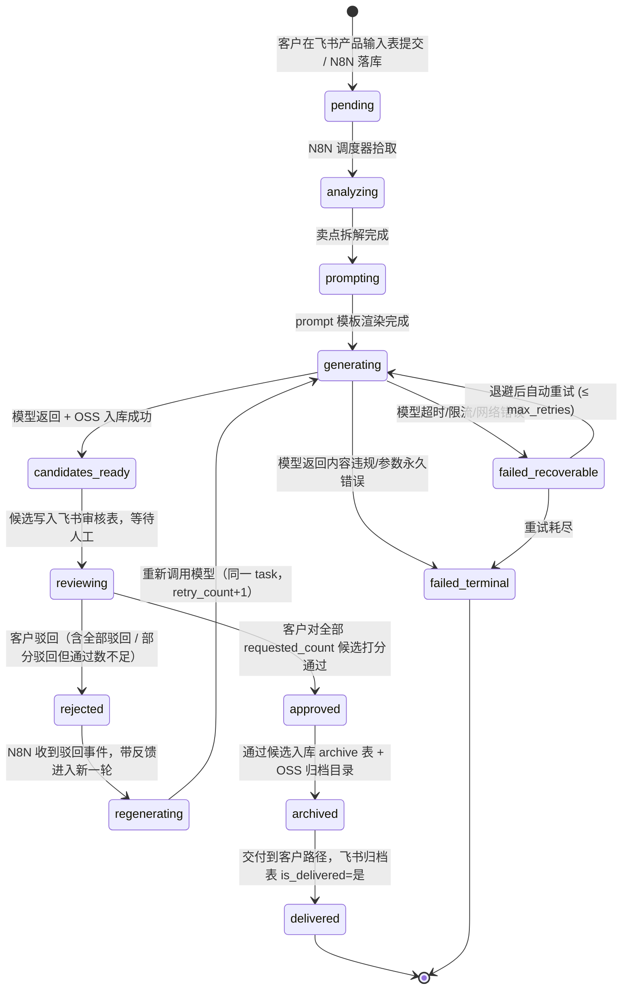

# 任务状态机

> 服装电商内容工厂 - 任务全生命周期状态流转
> 版本：v1.0  日期：2026-05-05
> 涵盖：图片链路 + 视频链路统一状态机
> 与 `postgres-init.sql` 中 `task_status` ENUM 严格一致

---

## 1. 状态图

---

## 2. 状态定义

| 状态 | 含义 | 进入时副作用 | 是否终态 |
|---|---|---|---|
| `pending` | 任务已创建，等待调度 | 写 `tasks` 行；飞书任务进度表新增一行 | 否 |
| `analyzing` | 卖点拆解中（LLM） | 创建 `generation_runs` (purpose=selling_point_extract) | 否 |
| `prompting` | prompt 渲染中 | `generation_runs` 出参回写 `tasks.parameters` | 否 |
| `generating` | 模型生成中 | 创建 `generation_runs` (purpose=image_*/video_*)；`tasks.started_at=now()` | 否 |
| `candidates_ready` | 候选已产出 | 写入 N 条 `candidates` (status=new)；写飞书候选审核表 N 行 | 否 |
| `reviewing` | 审核中 | 候选 `status=in_review` | 否 |
| `approved` | 任务整体通过 | `tasks.finished_at=now()`；触发归档 N8N | 否（再走 archived） |
| `rejected` | 任务整体被驳回 | 写 `audit_log` 多条 reject；候选 `status=rejected` | 否（再走 regenerating） |
| `regenerating` | 重新生成中 | `tasks.retry_count+=1`；带客户意见 + 上轮失败原因到新 prompt | 否 |
| `archived` | 已归档 | 写 `archive` 行；OSS 复制到归档桶；候选 `status=archived` | 否 |
| `delivered` | 已交付 | `archive.is_delivered=true`；飞书归档表勾选 | **是** |
| `failed_recoverable` | 可恢复失败 | 写 `tasks.error_message`；调度器按退避表重试 | 否 |
| `failed_terminal` | 终态失败 | 写 `tasks.error_message`；飞书告警 + 邮件 | **是** |

---

## 3. 完整转移表

| # | From | To | 触发事件 | 触发方 | 写入表 | 副作用 |
|---|---|---|---|---|---|---|
| 1 | `*` | `pending` | 飞书产品输入表新增/编辑 SKU + N8N 任务创建节点 | N8N `[trigger] feishu-products-watch` | `tasks` | 飞书任务进度表回写 record_id |
| 2 | `pending` | `analyzing` | 调度器轮询拾取（每 30s） | N8N `[scheduler] task-dispatcher` | `tasks.status`, `generation_runs` | 拉取产品 + 风格 + prompt 模板 |
| 3 | `analyzing` | `prompting` | 卖点拆解 LLM 返回 | N8N `[node] llm-extract-selling-points` | `generation_runs.output_payload`, `tasks.parameters` | - |
| 4 | `prompting` | `generating` | prompt 模板渲染完成 | N8N `[node] prompt-render` | `tasks.status` | - |
| 5 | `generating` | `candidates_ready` | 模型返回成功 + OSS 落地 | N8N `[node] model-call` + `[node] oss-upload` | `candidates` (N 条), `generation_runs.status=succeeded` | 写飞书候选审核表 N 行；缩略图生成 |
| 6 | `generating` | `failed_recoverable` | 限流/网络/超时 | N8N `[node] error-handler` | `generation_runs.status=failed`, `tasks.error_message` | 计算下次重试时间 |
| 7 | `generating` | `failed_terminal` | 内容违规 / 参数永久错误 | N8N `[node] error-handler` | `tasks.status`, `tasks.error_message` | 飞书告警；邮件 |
| 8 | `candidates_ready` | `reviewing` | 候选写飞书后状态推进 | N8N `[node] candidates-publish` | `tasks.status`, `candidates.status=in_review` | - |
| 9 | `reviewing` | `approved` | 通过候选数 ≥ requested_count | N8N `[trigger] feishu-audit-watch` + `[node] check-approval-quota` | `tasks.status`, `tasks.finished_at`, `audit_log` (approve), `candidates.status=approved` | 触发归档子流 |
| 10 | `reviewing` | `rejected` | 全部驳回 OR 通过数不足 + 已审核完所有候选 | N8N `[trigger] feishu-audit-watch` + `[node] check-rejection` | `tasks.status`, `audit_log` (reject), `candidates.status=rejected` | - |
| 11 | `rejected` | `regenerating` | 拒绝事件落库后立即推进（retry_count < max_retries） | N8N `[node] regenerate-decider` | `tasks.status`, `tasks.retry_count+=1` | 收集驳回意见进 prompt |
| 12 | `rejected` | `failed_terminal` | retry_count ≥ max_retries | N8N `[node] regenerate-decider` | `tasks.status`, `tasks.error_message` | 飞书告警 |
| 13 | `regenerating` | `generating` | 新一轮 prompt 渲染完成 | N8N `[node] prompt-render-v2` | `tasks.status`, `generation_runs` (新一条) | - |
| 14 | `failed_recoverable` | `generating` | 退避计时到 + 重试 (retry_count < max_retries) | N8N `[scheduler] retry-cron`（每 60s 扫一次） | `tasks.status`, `tasks.retry_count+=1` | - |
| 15 | `failed_recoverable` | `failed_terminal` | retry_count ≥ max_retries | N8N `[scheduler] retry-cron` | `tasks.status` | 飞书告警 |
| 16 | `approved` | `archived` | 归档子流执行成功 | N8N `[subflow] archive` | `archive`, `candidates.status=archived` | OSS 复制到归档桶；写飞书归档表 |
| 17 | `archived` | `delivered` | 客户在飞书归档表勾选"已交付" OR 自动交付配置开启 | 飞书人工 OR N8N `[node] auto-deliver` | `archive.is_delivered`, `archive.delivered_at`, `tasks.status` | 通知客户 |

---

## 4. 失败状态与重试策略

### 4.1 失败分类

| 失败码（`generation_runs.error_message` 前缀） | 分类 | 是否重试 |
|---|---|---|
| `RATE_LIMIT` / `429` | recoverable | 是 |
| `TIMEOUT` / `504` | recoverable | 是 |
| `NETWORK` / 连接失败 | recoverable | 是 |
| `5xx` 服务端错误 | recoverable | 是 |
| `CONTENT_POLICY` 违规 | terminal | 否 |
| `INVALID_PARAM` 参数错误 | terminal | 否 |
| `INSUFFICIENT_QUOTA` 配额耗尽 | terminal | 否（飞书告警，需充值） |
| `4xx` 客户端错误（非限流） | terminal | 否 |

### 4.2 重试退避表

| 链路 | 最大重试次数 (`max_retries`) | 退避策略 | 单次最大耗时 |
|---|---|---|---|
| image | 3 | 指数退避：30s → 2min → 10min | 5 分钟/次 |
| video | 2 | 线性退避：2min → 10min | 30 分钟/次（视频生成本身慢） |

> 退避计时由 N8N `[scheduler] retry-cron` 实现：每分钟扫描 `failed_recoverable` 任务，若 `now() - tasks.updated_at >= 退避区间` 则推进到 `generating`。

### 4.3 终态失败处理

- 写 `tasks.status = 'failed_terminal'`；
- 飞书任务进度表 `error_message` 同步显示失败原因；
- 通过飞书机器人推送到运维群；
- 人工修复后可在飞书任务进度表手动改回 `pending`，N8N 监听到该改动重新调度（这是唯一允许的人工状态回退）。

---

## 5. 副作用矩阵（速查）

| 转移 | 写 `tasks` | 写 `generation_runs` | 写 `candidates` | 写 `audit_log` | 写 `archive` | 飞书回写 |
|---|---|---|---|---|---|---|
| pending → analyzing | status | INSERT | - | - | - | 任务进度表 status |
| analyzing → prompting | parameters | UPDATE | - | - | - | - |
| prompting → generating | status, started_at | INSERT | - | - | - | 任务进度表 status |
| generating → candidates_ready | status | UPDATE (succeeded) | INSERT 多条 | - | - | 候选审核表 INSERT 多行 |
| generating → failed_recoverable | error_message | UPDATE (failed) | - | - | - | 任务进度表 error |
| candidates_ready → reviewing | status | - | UPDATE (in_review) | - | - | - |
| reviewing → approved | status, finished_at | - | UPDATE (approved) | INSERT (approve) | - | 任务进度表 status |
| reviewing → rejected | status | - | UPDATE (rejected) | INSERT (reject) | - | 任务进度表 status |
| rejected → regenerating | retry_count | - | - | - | - | 任务进度表 retry |
| regenerating → generating | status | INSERT | - | - | - | - |
| approved → archived | status | - | UPDATE (archived) | - | INSERT | 归档表 INSERT |
| archived → delivered | status | - | - | - | UPDATE (is_delivered) | 归档表 is_delivered |

---

## 6. 不变式（DB 约束 + N8N 校验双层）

1. 任意时刻同一 `task_id` 仅有一个非终态状态；
2. `candidates_ready` 时 `candidates` 行数 == `tasks.requested_count`；不足则任务回 `generating`；
3. `approved` 时至少一条 `candidates.status='approved'`；
4. `archived` 时必须存在对应 `archive` 行；
5. `delivered` 时 `archive.is_delivered=true` AND `archive.delivered_at IS NOT NULL`；
6. `tasks.retry_count <= tasks.max_retries`；越界自动转 `failed_terminal`。
